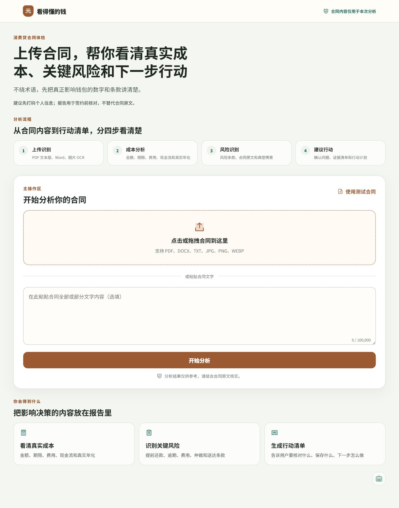
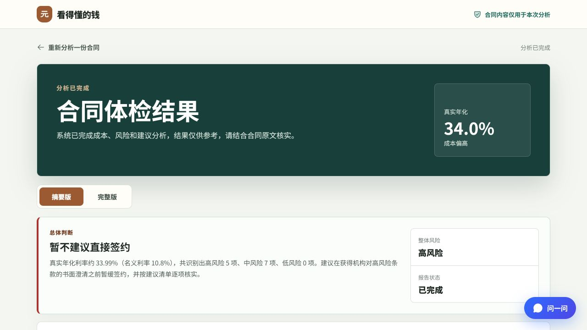
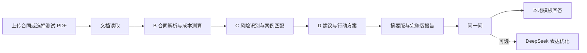
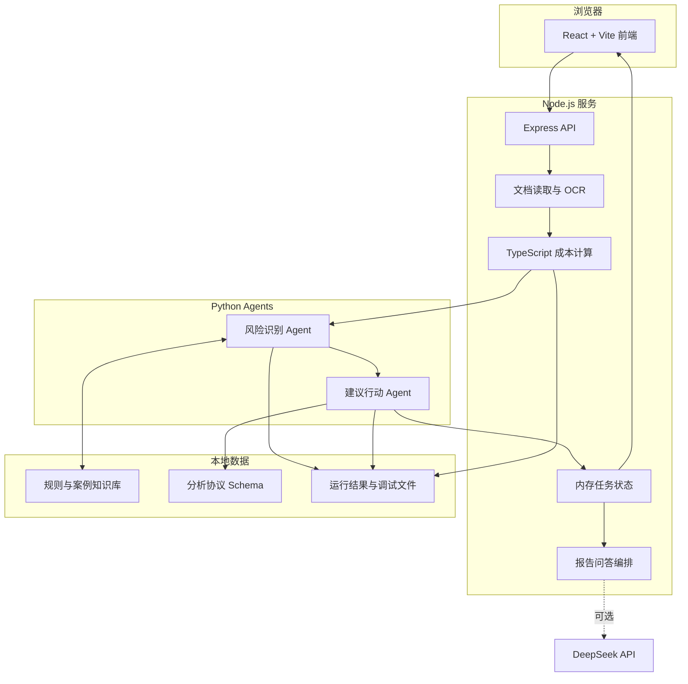

# 看得懂的钱

面向普通消费者的消费金融合同体检工具。用户上传合同后，系统会读取合同内容、计算真实融资成本、识别关键风险，并生成可以直接执行的核对问题和行动建议。

项目强调两件事：

- **真实计算**：真实年化利率由合同金额、实际到账、费用和还款现金流计算，不使用固定展示数字。
- **通俗表达**：报告优先解释“这对用户有什么影响、接下来该问什么”，避免直接堆叠规则、法条和内部 Agent 信息。

> 本项目用于课程交付和消费合同风险提示。分析结果仅供签约前核对，不替代合同原文、监管解释或专业法律意见。

## 页面预览

### 合同上传与测试合同



上传页支持本地文件、粘贴文字，以及仓库内置的 PDF 测试合同。老师或评审可以点击“使用测试合同”，先预览 PDF，再直接运行完整分析流程。

### 分析报告摘要



报告提供摘要版和完整版。摘要版突出总体判断、真实年化和优先事项；完整版保留费用明细、风险条款、案例依据、证据清单、沟通话术和分阶段行动方案。

## 核心能力

| 能力 | 当前实现 |
| --- | --- |
| 文档读取 | PDF 文本层、DOCX、TXT/MD、JPG/PNG/WEBP 图片 OCR |
| 成本分析 | 本金、实际到账、费用、月供、总还款、现金流 IRR、真实年化 |
| 风险识别 | 费用、还款、提前结清、逾期、隐私授权、合同变更、争议解决等 |
| 案例与依据 | 基于本地知识库进行规则、案例和条款关联；无可核验来源时不展示虚假链接 |
| 行动建议 | 必须确认事项、问题清单、证据清单、沟通话术和阶段化行动计划 |
| 报告问答 | 根据当前报告检索上下文，模板回答保底，DeepSeek 可选优化表达 |
| 测试体验 | 内置一份可预览、可真实分析的 PDF 测试合同 |

## 真实处理流程



1. **文档读取**：识别文件类型，提取 PDF 文本层、Word 文字、纯文本或图片 OCR 结果。
2. **B 合同与成本 Agent**：抽取金额、期限、利率、费用、还款方式和合同条款，建立现金流并计算真实年化。
3. **C 风险与案例 Agent**：执行 Python 风险规则，关联真实合同条款、知识库规则和典型情景。
4. **D 建议与行动 Agent**：根据 B/C 输出生成确认事项、证据清单、沟通话术和行动计划。
5. **报告问答**：只从当前报告取事实；配置 DeepSeek 后优化语言表达，调用失败自动回退本地模板。

## 系统架构



生产环境使用根目录 `Dockerfile` 构建单容器：Express 同时托管前端静态文件和 `/api` 接口，C/D Agent 作为 Python 子进程由后端调用，不需要额外部署 Python Web 服务。

## 技术栈

- 前端：React、TypeScript、Vite、React Router、Phosphor Icons
- 后端：Node.js 22、Express 5、TypeScript、Multer
- 文档处理：pdf-parse、Mammoth、Tesseract.js
- Agent：TypeScript 成本计算、Python 风险规则与知识检索、Python 行动建议
- 数据：JSON/CSV 知识种子、SQLite 运行知识库、JSON Schema
- 部署：Docker、腾讯云 CloudBase Run

## 快速开始

### 1. 环境要求

- Node.js 22
- pnpm 11
- Python 3.10 或更高版本

### 2. 安装依赖

```bash
pnpm install
python -m pip install -r agents/risk_case/requirements.txt
python -m pip install -r agents/recommendation_action/requirements.txt
```

Windows 如果 `python` 不可用，可以使用：

```powershell
py -3 -m pip install -r agents/risk_case/requirements.txt
py -3 -m pip install -r agents/recommendation_action/requirements.txt
```

### 3. 启动开发环境

```bash
pnpm run dev
```

- 前端：http://127.0.0.1:5173
- 后端：http://127.0.0.1:8080
- 健康检查：http://127.0.0.1:8080/api/health
- 就绪检查：http://127.0.0.1:8080/api/ready

本地启动脚本使用当前终端的系统环境变量。需要测试 DeepSeek 时，请先在终端设置 `ENABLE_CHAT_LLM`、`LLM_API_KEY`、`LLM_BASE_URL` 和 `LLM_MODEL`。

PowerShell 示例：

```powershell
$env:ENABLE_CHAT_LLM="true"
$env:LLM_API_KEY="你的密钥"
$env:LLM_BASE_URL="https://api.deepseek.com"
$env:LLM_MODEL="deepseek-v4-flash"
pnpm run dev
```

密钥只放在本地环境或部署平台，不要写入 `.env.example`、README、截图或 Git 提交。

## 环境变量

| 变量 | 默认值 | 说明 |
| --- | --- | --- |
| `VITE_USE_MOCK_PIPELINE` | `false` | `false` 调用真实 Pipeline；`true` 仅用于本地界面开发 |
| `VITE_API_BASE_URL` | 空 | 前端 API 地址；生产同源部署保持为空 |
| `VITE_DISABLE_CHAT` | `false` | 前端隐藏“问一问”入口 |
| `PORT` | `8080` | Express 监听端口 |
| `SERVE_FRONTEND` | `false` | 是否由 Express 托管前端构建产物；Docker 内为 `true` |
| `FRONTEND_DIST` | `website/frontend/dist` | 前端静态文件目录 |
| `PROJECT_ROOT` | 自动推断 | 项目根目录 |
| `KNOWLEDGE_BASE_ROOT` | 自动推断 | 合同金融知识库目录 |
| `RUNTIME_ROOT` | 本地 `.runtime` | Pipeline 中间文件目录；生产为 `/tmp/money-agent-runtime` |
| `PYTHON_BIN` | 自动尝试 | Python 命令或绝对路径；Docker 为 `/opt/venv/bin/python` |
| `SCHEMA_PATH` | 仓库内协议 Schema | D Agent 输出校验文件 |
| `CORS_ORIGIN` | 空 | 跨域允许来源，多个来源用逗号分隔；同源部署无需设置 |
| `PIPELINE_DEBUG_TRACE` | 开发环境开启 | 是否输出详细运行链路 |
| `DISABLE_CHAT` | `false` | 后端关闭报告问答 |
| `ENABLE_CHAT_LLM` | `false` | 是否启用 DeepSeek 表达优化 |
| `LLM_API_KEY` | 空 | 服务端大模型密钥 |
| `LLM_BASE_URL` | `https://api.deepseek.com` | OpenAI Chat Completions 兼容地址 |
| `LLM_MODEL` | `deepseek-v4-flash` | 报告问答模型名称 |

### DeepSeek 的实际作用

DeepSeek **只用于“问一问”的表达优化**，不会替代以下核心步骤：

- 合同字段抽取
- 费用与真实年化计算
- 风险规则判定
- 案例匹配
- D Agent 行动建议生成

即使没有配置 DeepSeek，完整合同分析和报告仍然可以运行；问答会自动使用本地模板回答。

## 使用内置测试合同

1. 打开上传页。
2. 点击“使用测试合同”。
3. 可先点击“预览 PDF”检查合同原文。
4. 点击“开始分析”。
5. 等待系统自动进入报告页。
6. 查看摘要版、完整版、案例依据和建议行动。
7. 打开“问一问”，例如提问“真实年化利率是多少？”

测试文件：

- `tests/fixtures/模拟职业培训消费分期借款合同_Agent综合测试.pdf`
- `tests/fixtures/模拟职业培训消费分期借款合同_Agent综合测试.txt`

当前验收基准：

- 合同本金：20,000 元
- 实际支付：18,600 元
- 真实年化：约 33.99%
- 风险数量：12 项

## 核心接口

### 服务状态

| 方法 | 路径 | 说明 |
| --- | --- | --- |
| `GET` | `/api/health` | 进程健康检查 |
| `GET` | `/api/ready` | 知识库、Python、Agent 和 Schema 就绪检查 |

### 真实 Pipeline

| 方法 | 路径 | 说明 |
| --- | --- | --- |
| `POST` | `/api/pipeline/analyze` | 上传合同或提交合同文字，创建分析任务 |
| `GET` | `/api/pipeline/:taskId/status` | 查询处理进度 |
| `GET` | `/api/pipeline/:taskId/result` | 获取最终报告 |
| `POST` | `/api/pipeline/:taskId/chat` | 基于当前报告提问 |
| `GET` | `/api/pipeline/:taskId/chat/history` | 获取当前任务的问答历史 |

### B 模块兼容接口

以下接口保留用于模块测试和兼容，不是生产前端主路径：

- `POST /api/analysis`
- `POST /api/analysis/upload`
- `POST /api/analysis/demo`
- `GET /api/analysis/:taskId/status`
- `GET /api/analysis/:taskId/result`
- `GET /api/analysis/:taskId/b-output`
- `GET /api/analysis/:taskId/contract-cost-output`

## 验证与测试

```bash
# 全仓库代码规范
pnpm run lint

# 前后端生产构建
pnpm run build

# B Agent 验证
pnpm run verify:b-agents

# B/C/D 集成验证
pnpm run verify:bcd-pipeline

# 报告问答验证
pnpm run verify:chat

# PDF 合同完整回归
pnpm run test:contract-regression

# Python 单元测试
cd agents/risk_case
python -m pytest

cd ../recommendation_action
python -m pytest
```

`test:contract-regression` 会检查：

- PDF 多页文本读取
- 金额、费用、月供和真实年化计算
- B 条款与 C 风险证据链
- 风险与案例去重
- 虚假 `example.com` 来源不对用户开放
- 空来源分组不进入最终报告
- D 沟通话术实际进入报告
- 完整调试链路文件生成

## Docker 与腾讯云部署

### 本地构建镜像

```bash
docker build -t money-agent-cloudbase .
docker run --rm -p 8080:8080 money-agent-cloudbase
```

根目录 `Dockerfile` 会：

1. 安装 pnpm 工作区依赖。
2. 以真实 Pipeline 模式构建前端。
3. 构建 TypeScript 后端。
4. 创建 Python 虚拟环境并安装 C/D Agent 依赖。
5. 将前端、后端、Agent、知识库、OCR 模型和 Schema 打入单一镜像。
6. 由 Express 在 `8080` 端口同时提供网页和 API。

腾讯云建议配置：

```text
NODE_ENV=production
PORT=8080
SERVE_FRONTEND=true
PROJECT_ROOT=/app
KNOWLEDGE_BASE_ROOT=/app/knowledge_base/contract_finance
RUNTIME_ROOT=/tmp/money-agent-runtime
PYTHON_BIN=/opt/venv/bin/python
SCHEMA_PATH=/app/shared/schemas/analysis-protocol-v1.schema.json
ENABLE_CHAT_LLM=true
LLM_API_KEY=<在腾讯云控制台填写>
LLM_BASE_URL=https://api.deepseek.com
LLM_MODEL=deepseek-v4-flash
```

健康检查路径使用 `/api/health`。部署完成后还应访问 `/api/ready`，确认返回 `ready` 再切换流量。

更详细的腾讯云步骤见：[docs/tencent-cloudbase-deployment.md](docs/tencent-cloudbase-deployment.md)。

## 项目目录

```text
money-agent/
├─ agents/
│  ├─ risk_case/                    # C 风险识别、规则、案例与知识检索
│  └─ recommendation_action/        # D 建议、证据、话术与行动计划
├─ knowledge_base/contract_finance/ # 合同字段词典、产品规则和成本阈值
├─ shared/                          # 跨前后端类型和分析协议
├─ tests/fixtures/                  # 集成测试与内置测试合同
├─ scripts/                         # 验证、回归和调试脚本
├─ docs/
│  ├─ images/                       # README 页面截图
│  └─ tencent-cloudbase-deployment.md
├─ website/
│  ├─ frontend/                     # React 用户界面
│  └─ backend/                      # Express API 与 Pipeline 编排
├─ Dockerfile                       # 单容器生产构建
└─ README.md
```

## 数据与隐私

- 建议用户上传前打码姓名、身份证、手机号、银行卡等敏感信息。
- 报告问答发送给大模型前会遮蔽身份证、银行卡、手机号和显式姓名。
- 生产环境默认不输出详细调试文件到仓库目录。
- API 密钥只存在服务端环境变量中，不进入前端构建产物。
- 报告只展示可核验的 HTTP/HTTPS 来源链接；占位或无效链接会被过滤。

## 当前边界

- 任务状态和聊天记录保存在进程内存中，适合单实例 MVP；容器重启后旧任务会丢失。
- PDF 当前读取文本层；扫描版 PDF 建议转成清晰图片上传，或直接粘贴合同文字。
- 图片 OCR 以中文消费合同为主要场景，识别质量取决于图片清晰度和排版。
- 知识库包含规则和典型化案例，不能替代法院裁判、监管解释或律师意见。
- DeepSeek 是可选的语言增强层，不参与真实年化计算和核心风险判定。

## 交付验收清单

- [ ] `/api/health` 返回 `ok`
- [ ] `/api/ready` 返回 `ready`
- [ ] 内置 PDF 可以预览
- [ ] 内置 PDF 可以生成完整报告
- [ ] 摘要版显示真实年化、总体风险和优先行动
- [ ] 完整版显示费用、风险、依据、证据和沟通话术
- [ ] “问一问”能回答当前报告问题
- [ ] 配置 DeepSeek 时，聊天接口返回 `mode: "llm"`
- [ ] 手机宽度下页面和问答窗口无明显遮挡
